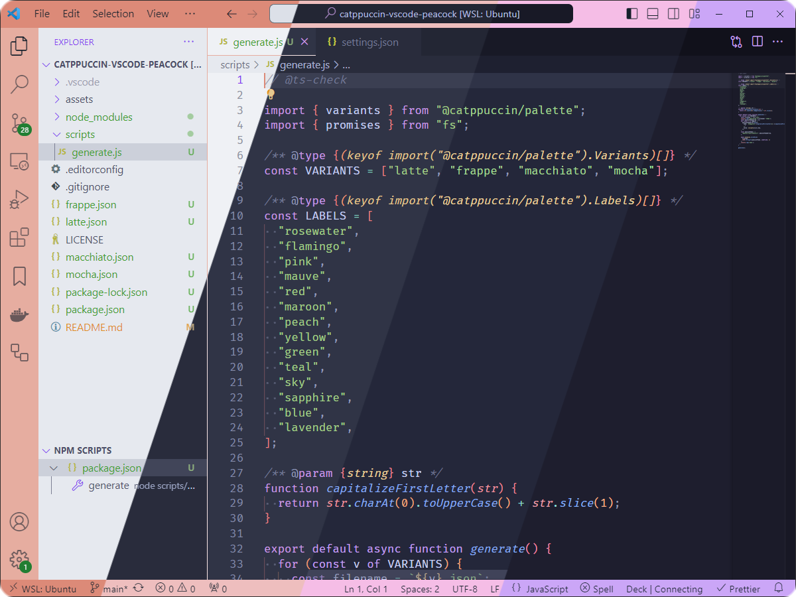
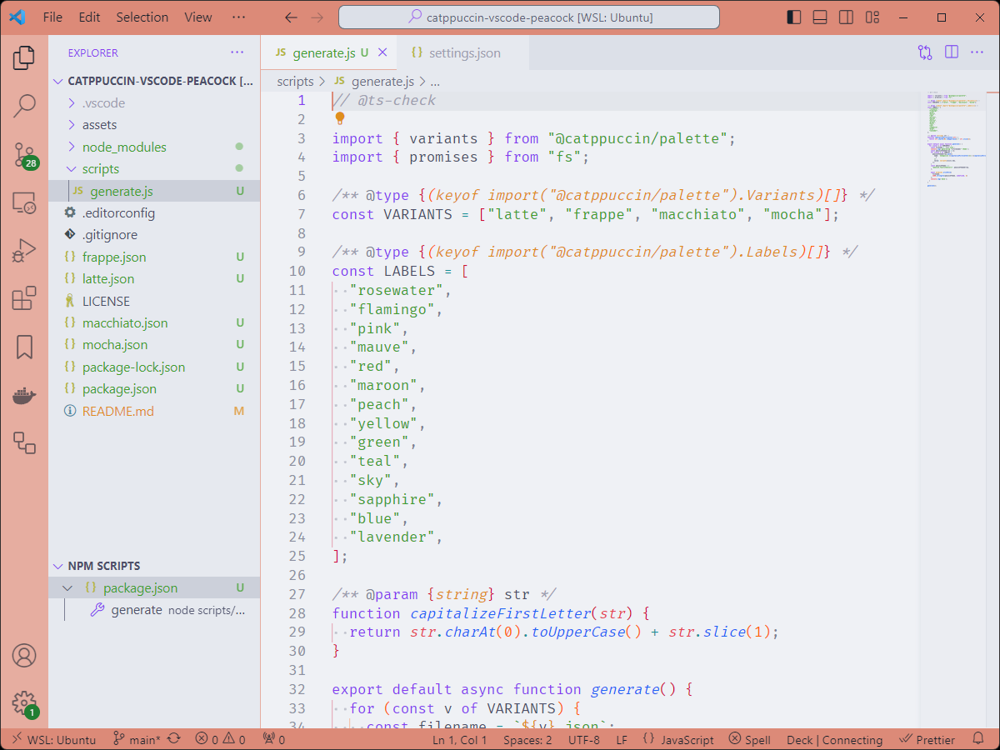
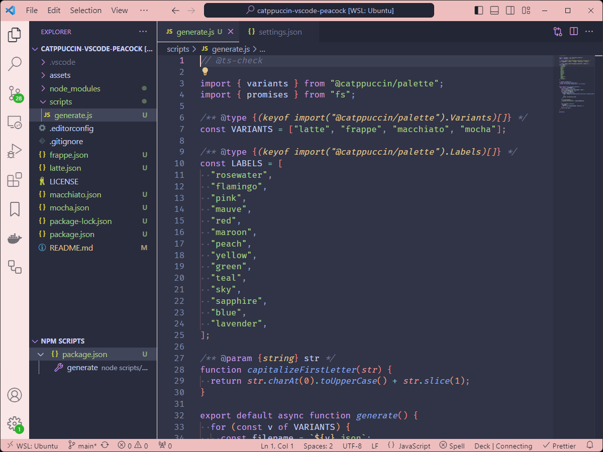
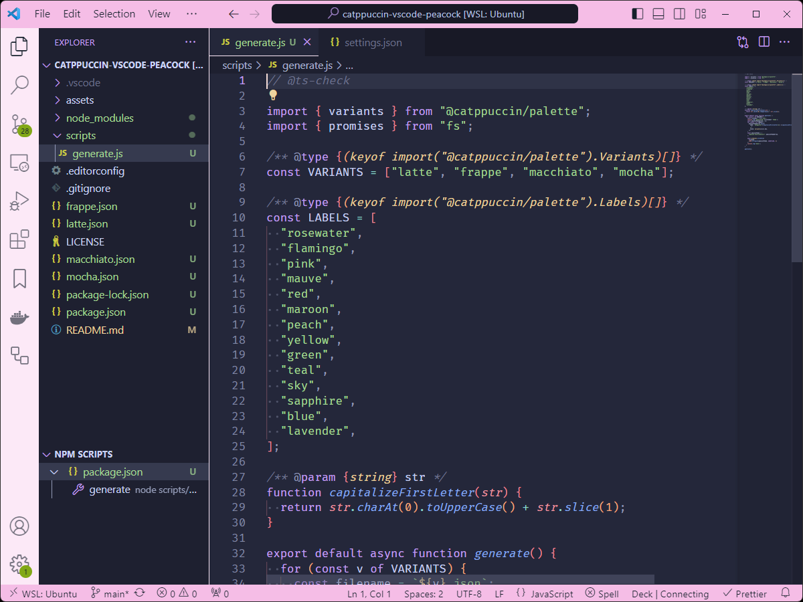
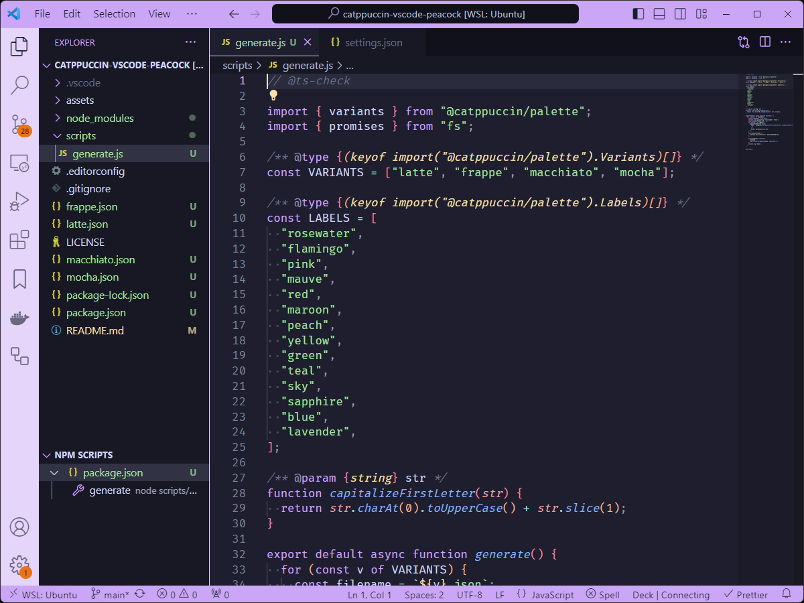

<h3 align="center">
	<br/>
	
	Catppuccin for <a href="https://github.com/repraze/catppuccin-vscode-peacock">VSCode Peacock</a>
	
</h3>

<p align="center">
	<a href="https://github.com/repraze/catppuccin-vscode-peacock/stargazers"></a>
	<a href="https://github.com/repraze/catppuccin-vscode-peacock/issues"></a>
	<a href="https://github.com/repraze/catppuccin-vscode-peacock/contributors"></a>
</p>

<p align="center">
	
</p>

## Previews

<details>
<summary>🌻 Latte</summary>

</details>
<details>
<summary>🪴 Frappé</summary>

</details>
<details>
<summary>🌺 Macchiato</summary>

</details>
<details>
<summary>🌿 Mocha</summary>

</details>

Previews with [Catppuccin for VSCode](https://github.com/catppuccin/vscode).

## Usage

1. Launch VSCode
2. [Install Peacock](https://marketplace.visualstudio.com/items?itemName=johnpapa.vscode-peacock)
3. Within the command pallette, <kbd>Ctrl</kbd> + <kbd>Shift</kbd> + <kbd>P</kbd>, search for `Preferences: Open User Settings (JSON)`
4. Choose your _flavour_ (frappe, latte, macchiato, mocha)
5. Copy the peacock property of _flavour.json_ into your `settings.json`:

```json
{
  // other vscode settings
  "peacock.favoriteColors": [
    // catppuccin flavour colors
    // other favorite colors
  ]
}
```

6. Save and exit
7. Within the command pallette, <kbd>Ctrl</kbd> + <kbd>Shift</kbd> + <kbd>P</kbd>, search for `Peacock: Change to a Favorite Color`
8. Select your favorite one 🌈

As a bonus, you can set Peacock to `Surprise Me From Favorites Only` and `Surprise Me On Startup`.

<!-- this section is optional -->

## 💻 Development

The `.json` files can be regenerated when the palette is updated.

1. Clone the repo.
2. Run `npm install`
3. Run `npm run generate`
4. All `.json` files should be regenerated

## 💝 Thanks to

- [Thomas Dubosc](https://github.com/repraze)

&nbsp;

<p align="center">
	
</p>

<p align="center">
	Copyright &copy; 2021-present <a href="https://github.com/catppuccin" target="_blank">Catppuccin Org</a>
</p>

<p align="center">
	<a href="https://github.com/catppuccin/catppuccin/blob/main/LICENSE"></a>
</p>
